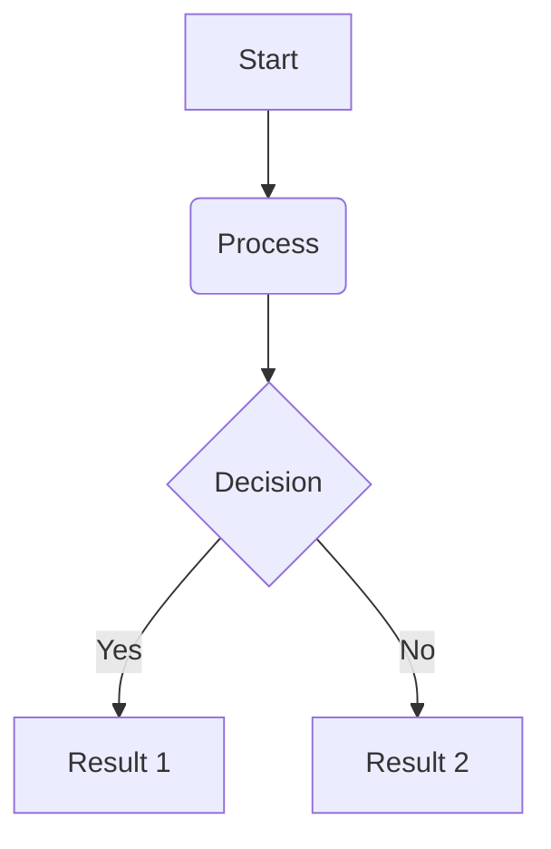

import { Callout, Figure, YouTube } from "@/mdx-components"

Use this file as a cheat sheet. Open `/writing/preview` to edit, validate, and publish.

Posts live in `content/` and are auto-discovered. Use `visibility: unlisted` to hide from `/writing` while keeping a shareable URL.

The **title** comes from frontmatter — don't use `#` in the body. Use `##` and `###` for section headings inside the post.

## Frontmatter

Every post starts with YAML frontmatter between `---` lines:

```yaml
---
title: Your Post Title
description: One sentence summary for SEO and social cards.
publishDate: 14.Jun.2026
modifiedDate: 14.Jun.2026
author: Aakash Sondagar
ogImage: https://aakashsondagar.vercel.app/assets/og-images/your-image.jpg
keywords: comma, separated, tags
visibility: public
---
```

Required: `title`, `description`, `publishDate`. Use `visibility: unlisted` while writing or for link-only posts.

`visibility` values:
- `public` — listed on `/writing` and home
- `unlisted` — hidden from indexes, reachable at `/writing/your-slug`

Legacy `draft: true` still works and maps to `unlisted`.

## Custom MDX blocks

Import components at top of file:

```mdx
import { Callout, Figure, YouTube } from "@/mdx-components"
```

Examples:

<Callout type="note" title="Heads up">
Custom blocks are React components — same pipeline in preview and published posts.
</Callout>

<Callout type="tip">
Use `type="note"`, `type="tip"`, or `type="warning"`.
</Callout>

<Figure src="/assets/profile.png" alt="Profile photo" caption="Example figure with caption" />

<YouTube id="dQw4w9WgXcQ" title="Example embed" />

## Paragraphs

Write normal prose as plain text. Separate paragraphs with a blank line.

This is a second paragraph. Keep lines readable — one idea per paragraph works best on this site.

## Bold and italic

**Bold text** uses double asterisks.

*Italic text* uses single asterisks.

***Bold and italic*** uses triple asterisks.

You can also use __bold__ and _italic_ with underscores, but asterisks are more common in this codebase.

## Links

Inline links: [Peerlist](https://peerlist.io)

Links with title tooltip: [Paul Graham essays](https://paulgraham.com/articles.html "Startup essays")

Bare URLs also work: https://aakashsondagar.vercel.app

## Blockquotes

Use `>` for pull quotes or cited lines. These render with a left border and italic style.

> The best designers I know don't just make things look good. They make things feel inevitable.

Multi-line blockquote:

> First line of the quote.
>
> Second line after a blank `>` line.

## Section headings

## This is an H2

Use `##` for main sections inside a post. This is the primary heading style on the site.

### This is an H3

Use `###` for subsections under an H2.

Avoid `#` (H1) in the body — the page title already comes from frontmatter.

## Lists

### Unordered

- First item
- Second item
- Third item with **bold** inside

Nested unordered:

- Parent item
  - Child item
  - Another child
- Back to parent level

### Ordered

1. First step
2. Second step
3. Third step

Nested ordered:

1. Main step
   1. Sub-step A
   2. Sub-step B
2. Next main step

### Task lists

Marked supports GitHub-style checkboxes:

- [x] Done item
- [ ] Todo item

## Inline code

Use backticks for `variable names`, `file.md`, `npm run dev`, and short snippets inside a sentence.

## Code blocks

Fenced blocks with triple backticks:

```js
function greet(name) {
  return `Hello, ${name}`;
}

greet("world");
```

Other languages:

```css
.article-content blockquote {
  font-style: italic;
}
```

```bash
npm run dev
```

Plain fence with no language:

```
content/
  buy-a-domain.md
  new.md
```

## Diagrams

You can write native diagrams inside your markdown posts using standard `mermaid` fenced code blocks:



Renders as:


### Alternative: Inline SVG
Since MDX compiles directly into React components, you can also write native `<svg>` code inline inside your markdown file for custom visual assets:

<svg width="240" height="120" viewBox="0 0 240 120" className="mx-auto my-4 text-olive-800 dark:text-olive-100">
  <rect x="10" y="10" width="80" height="40" rx="5" fill="currentColor" opacity="0.1" stroke="currentColor" strokeWidth="2" />
  <text x="50" y="35" textAnchor="middle" fontSize="12" fontWeight="bold" fill="currentColor">Start</text>
  
  <path d="M 90 30 L 140 30" stroke="currentColor" strokeWidth="2" fill="none" />
  
  <rect x="150" y="10" width="80" height="40" rx="5" fill="currentColor" opacity="0.1" stroke="currentColor" strokeWidth="2" />
  <text x="190" y="35" textAnchor="middle" fontSize="12" fontWeight="bold" fill="currentColor">Process</text>
</svg>

## Horizontal rule

Use three or more dashes on their own line:

---

Good for breaking long essays into parts.

## Images

```md

```

Remote images work too:

```md

```

Always add meaningful alt text.

## Emphasis patterns used in real posts

Opening with a strong line:

**When you buy a domain, something changes.** The rest of the paragraph continues normally.

Section opener + body (common pattern):

## Talk to Your Users. Really Talk to Them.

This one cannot be overstated: talk to your users. Not through forms — actually talk to them.

Quote after a section:

> "It's better to have 100 people who love you than 1,000 who sort of like you."

Closing with a rule:

> So when you get that next idea, don't open your code editor first. Buy the domain. Then build something worth putting there.

## Tables

Standard markdown tables render via marked:

| Style        | Syntax              | Renders on site |
| ------------ | ------------------- | --------------- |
| Bold         | `**text**`          | Yes             |
| Blockquote   | `> text`            | Yes             |
| H2 / H3      | `##` / `###`        | Yes             |
| Inline code  | `` `code` ``        | Yes             |
| Tables       | `\| col \| col \|`  | Yes             |

## Strikethrough

~~Crossed out text~~ uses double tildes (GitHub-flavored markdown).

## Line breaks

End a line with two spaces  
to force a single line break inside the same paragraph.

Or use a blank line between paragraphs (preferred).

## HTML (limited)

MDX passes through some raw HTML if you need it:

<em>HTML italic</em> and <strong>HTML bold</strong> work, but prefer markdown syntax when possible.

## What not to use

- `#` H1 in body — duplicates the page title
- Heavy nesting — keep lists 2 levels deep max
- Huge tables — they don't match the narrow reading layout
- Custom classes or inline styles — the site only styles `.article-content` elements

## Publish flow

1. Create `content/your-slug.mdx` (or `.md`)
2. Add frontmatter with `visibility: unlisted`
3. Open `/writing/preview` — edit, validate, preview live
4. Set `visibility: public` when ready for `/writing`
5. Save file — public posts appear on `/writing` automatically
6. Live URL: `/writing/your-slug` (works for public and unlisted)
